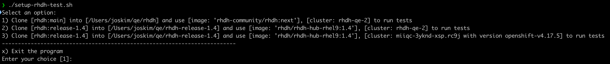
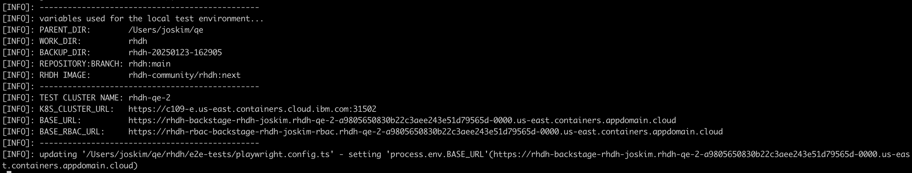
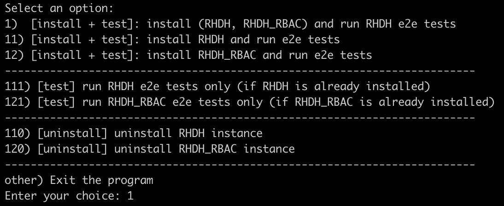
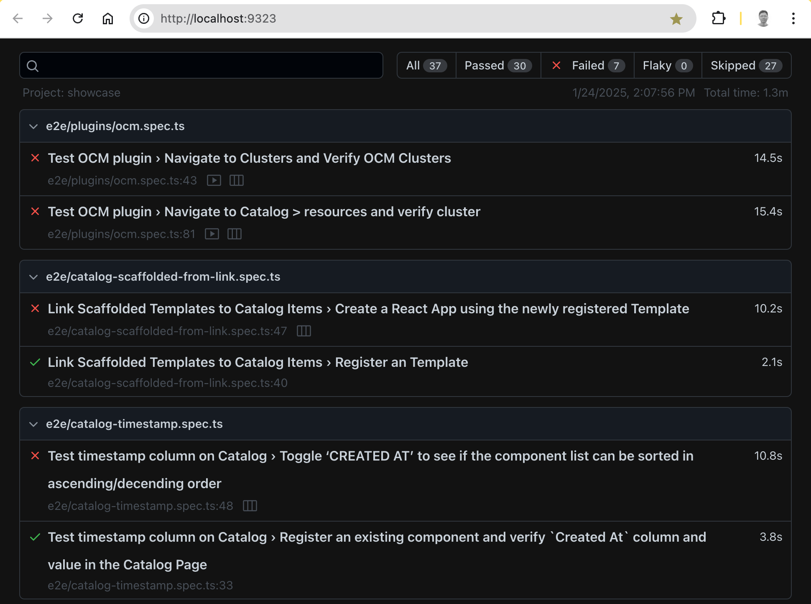
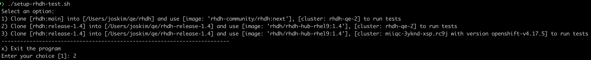
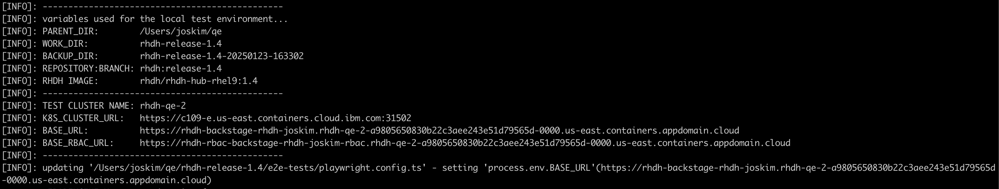

# Local Test Environment for Red Hat Developer Hub End-to-End Tests

This guide explains how to set up a local test environment to run [end-to-end tests](https://github.com/redhat-developer/rhdh/tree/main/e2e-tests/playwright/e2e) using your own cluster.

### **Configuration Notes**

> ⚠️ **Note:** The steps and files referenced in this guide are based on macOS. If you're using another operating system, minor adjustments may be required.


## **Prerequisites**

1. **Access to Vault**Ensure you have login access to [Vault](https://vault.ci.openshift.org/ui/vault/secrets/kv/show/selfservice/rhdh-qe/rhdh). For access, contact `@rhdh-qe`.
2. **npm Installation**

   - `npm` is required by the`setup-rhdh-test.sh` script to install [dotenv](https://www.npmjs.com/package/dotenv) indirectly.
   - After the initial installation of`dotenv`, you may skip additional installations by commenting out the`install_dotenv` function in`setup-rhdh-test.sh`.

3. **RHDH Pull Secret**Ensure you have the file `auth/rhdh-pull-secret.yaml` to access the [RHDH container image](https://quay.io/repository/rhdh-community/rhdh). Follow this [guide](https://docs.google.com/document/d/1X40OGE7h0UW-nNGnkqW1ymsmgsK4zICmMuHvzFHlUzw/edit?tab=t.0#bookmark=id.i9ubi2cljqjc) to create the pull secret.
4. **OCP Cluster**
   Make sure you have access to an OpenShift Container Platform (OCP) cluster.

---

## **Steps to Set Up the Local Test Environment**

### **For RHDH Next**

Using the [main](https://github.com/redhat-developer/rhdh) branch and [next](https://quay.io/repository/rhdh-community/rhdh) RHDH image.

#### 1. Clone the repository

```bash
git clone git@github.com:josephca/rhdh-local-test.git
```

#### 2. Update the `config_localtest.sh` file

Modify the following sections with your custom values:

- `[1] Set your GitHub user ID and fork name`
- `[2] Set your test cluster variables`
- `[3] Set your optional test cluster variables`

#### 3. Update the `local_env_variables.sh` file

Edit the file located at `files/.ibm/pipelines/local_env_variables.sh` and provide the following details:

- `[1] Set your test cluster variables`
- `[2] Set your namespace name`

#### 4. Run the setup script

Execute the script to set up the environment:

```bash
./setup-rhdh-test.sh
```



- Press`Enter` to accept the default option (Option 1). The script will:
  - Backup your existing`rhdh` folder and clone the [RHDH repository](https://github.com/redhat-developer/rhdh).
  - Display the configuration of your local test environment.
  - Update`process.env.BASEURL` in`rhdh/e2e-tests/playwright.config.ts`.



#### 5. Run the test script

Navigate to the pipelines folder:

```bash
cd rhdh/.ibm/pipelines
```

Run the test script:

```bash
./localtest_main.sh
```

#### 6. Authenticate with Vault

When prompted with `Waiting for OIDC authentication to complete...`, log in to [Vault](https://vault.ci.openshift.org/ui/vault/secrets/kv/show/selfservice/rhdh-qe/rhdh). This prompt only appears during the initial login.



#### 7. Choose the test option

Select Option 1 to:

- Install both RHDH and RHDH_RBAC instances.
- Run RHDH end-to-end tests.

The test results will appear in your command window and browser.

- To run RHDH_RBAC end-to-end tests, press`Ctrl+C` to close the browser with test results, then run`./localtest_main.sh` and select`121`

> 🚀 **Note:** Some tests may require additional configuration to pass successfully.



---

### **For RHDH v1.4**

Using the [release-1.4](https://github.com/redhat-developer/rhdh/tree/release-1.4) branch and [release-1.4](https://quay.io/repository/rhdh/rhdh-hub-rhel9) RHDH image.

#### 1. Clone the repository

```bash
git clone git@github.com:josephca/rhdh-local-test.git
```

#### 2. Update the `config_localtest.sh` file

Modify the following sections with your custom values:

- `[1] Set your GitHub user ID and fork name`
- `[2] Set your test cluster variables`
- `[3] Set your optional test cluster variables`

#### 3. Update the `local_env_variables_1.4.sh` file

Edit the file located at `files/.ibm/pipelines/local_env_variables_1.4.sh` and provide the following details:

- `[1] Set your test cluster variables`
- `[2] Set your namespace name`

#### 4. Run the setup script

```bash
./setup-rhdh-test.sh
```



Select `Option 2` or `Option 3` to set up the environment for `release-1.4` with a test cluster. The script will:

- Backup your existing`rhdh` folder and clone the [RHDH repository](https://github.com/redhat-developer/rhdh).
- Display the configuration of your local test environment.
- Update`process.env.BASEURL` in `rhdh/e2e-tests/playwright.config.ts`.
- 

#### 5. Run the test script

Navigate to the pipelines folder:

```bash
cd rhdh/.ibm/pipelines
```

Run the test script for v1.4:

```bash
./localtest_1.4.sh
```

#### 6. Follow the remaining steps

The remaining steps, such as Vault authentication and test execution, are the same as described for **RHDH Next**.

---
